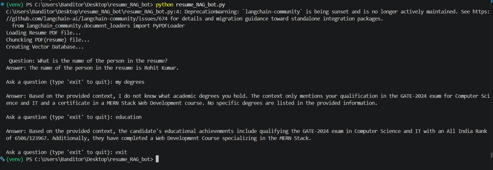

# 📄 Resume RAG Bot (Version 1)

A Retrieval-Augmented Generation (RAG) application that allows users to ask natural language questions about a resume PDF. The application uses LangChain, Google Gemini, and ChromaDB to retrieve relevant information from the resume and generate concise, context-aware responses.

---

## 🚀 Features

- 📄 Load Resume PDF
- ✂️ Split resume into semantic chunks
- 🧠 Generate embeddings using Gemini Embeddings
- 💾 Store embeddings in ChromaDB
- 🔍 Retrieve relevant chunks using semantic search
- 🤖 Generate answers using Gemini 3.5 Flash
- 💬 Interactive command-line chatbot

---

## 🛠️ Tech Stack

- Python
- LangChain
- Google Gemini API
- ChromaDB
- PyPDF
- python-dotenv

---

## 📂 Project Structure

```text
resume_RAG_bot/
│
├── resume_RAG_bot.py
├── requirements.txt
├── README.md
├── .gitignore
├── .env
├── resume.pdf
└── chroma_db/        # Generated automatically
```

---

## ⚙️ Installation

### 1. Clone the repository

```bash
git clone https://github.com/yourusername/resume_RAG_bot.git
cd resume_RAG_bot
```

### 2. Create a virtual environment

```bash
python -m venv venv
```

Activate it

Windows

```bash
venv\Scripts\activate
```

Linux / macOS

```bash
source venv/bin/activate
```

---

### 3. Install dependencies

```bash
pip install -r requirements.txt
```

---

### 4. Create a `.env` file

```env
GOOGLE_API_KEY=YOUR_API_KEY
```

---

### 5. Add your resume

Place your resume PDF in the project directory.

Example:

```
resume.pdf
```

If using another filename, update it inside `resume_RAG_bot.py`.

---

## ▶️ Run the Application

```bash
python resume_RAG_bot.py
```

---

## 💬 Example

```text
Question:
What is the name of the person in the resume?

Answer:
The name of the person in the resume is Rohit Kumar.
```

---

## 📸 Demo

> Interactive command-line question answering over a resume.



---

## 🔄 RAG Pipeline

```
Resume PDF
      │
      ▼
PyPDFLoader
      │
      ▼
RecursiveCharacterTextSplitter
      │
      ▼
Gemini Embeddings
      │
      ▼
Chroma Vector Database
      │
      ▼
Retriever
      │
      ▼
Prompt Template
      │
      ▼
Gemini 3.5 Flash
      │
      ▼
Generated Answer
```

---

## 📌 Current Limitations (Version 1)

- Retrieval accuracy can decrease for very short or ambiguous queries.
- Single PDF support.
- Command-line interface only.
- No conversation memory.
- No query rewriting.

---

## 🚀 Planned Improvements

### Version 2

- Query Rewriting
- MultiQuery Retriever
- Better Retrieval Accuracy
- Improved Chunking Strategy


### Version 3

- Streamlit Web Interface
- PDF Upload
- Multiple Resume Support
- Chat History
- Source Citations

### Version 4

- Hybrid Search (Vector + BM25)
- Reranking
- Conversation Memory
- Docker Deployment
- Cloud Deployment

---

## 📚 Concepts Used

- Retrieval-Augmented Generation (RAG)
- Semantic Search
- Embedding Models
- Vector Databases
- Prompt Engineering
- Large Language Models (LLMs)

---

## 👨‍💻 Author

**Rohit Kumar**

Delhi Technological University

GitHub: https://github.com/r9hit